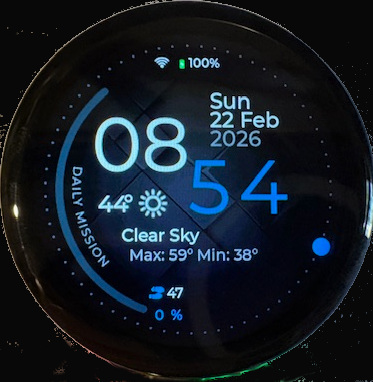
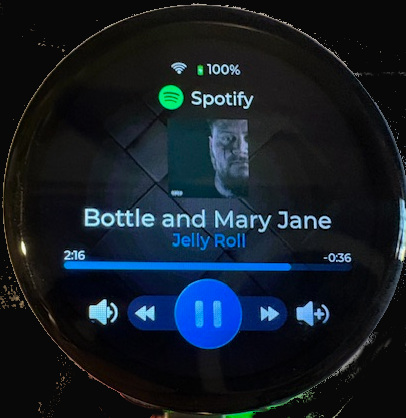

# ESP32-S3 Smartwatch (Personal Project)

This is my personal smartwatch project built on the ESP32-S3. I started it to learn more about embedded UI work, BLE integration, and what this Waveshare board could actually do in day-to-day use.

## Why I Built This

I wanted a smartwatch project that was fun to build, practical enough to use, and open enough to keep evolving over time. This repo is where I experiment with features I care about (notifications, timers, weather, media control) while learning more about ESP32, LVGL, and BLE integration.

If you are building something similar, I hope this gives you a useful starting point and saves you some time.

I built this around the Waveshare ESP32-S3 Touch LCD 1.46" board (412x412), which includes:

- Wi-Fi + Bluetooth
- Accelerometer + gyroscope
- Onboard speaker + microphone
- ESP32-S3 with PSRAM

## Hardware and References

Board references:

- Product: https://www.waveshare.com/esp32-s3-touch-lcd-1.46b.htm
- Wiki: https://www.waveshare.com/wiki/ESP32-S3-Touch-LCD-1.46B#Resources

## Screenshots

### Main Screen



### Media Screen



More screenshots: [screenshots/](screenshots/)

## Current Features

- Timer
- Alarm
- Stopwatch
- Calculator
- Weather (hourly and daily)
- Step counter
- Settings (Wi-Fi, brightness, volume, etc.)
- Calendar sync (iOS)
- Notifications (iOS)
- Call answering (iOS)
- Media controls (iOS)

## Phone Integration (iOS)

I designed the watch to work with iOS without a companion app by using Apple BLE protocols:

- ANCS (Apple Notification Center Service)
- AMS (Apple Media Service)

I have not tested Android support. The iOS-specific features above rely on Apple protocols, but most of the non-iOS watch features should still work.

## UI and Firmware Stack

I build the UI with [EEZ Studio](https://www.envox.eu/studio/studio-introduction/) and LVGL.
EEZ Studio generates lightweight C code that compiles directly into the firmware, which keeps iteration fast.

## Development Environment

- VS Code
- PlatformIO
- Arduino framework (configured in `platformio.ini`)

If you want to modify the UI, I strongly recommend:

- EEZ Studio

## Build and Flash

From the project root, I usually run:

```bash
pio run
pio run -t upload
pio device monitor
```

The PlatformIO environment in this repo is `waveshare_s3_146`.

## SD Card Setup and Config

The watch expects an SD card for alarm/timer sounds and persisted settings.

1. Format a blank SD card.
2. Copy the contents of `sd-card/` to the root of the SD card.
3. Insert the card before normal use.

I store settings at:

- `/System/config.json`

For calendar integration, I manually add iCal URL entries in that config file.

## Known Limitations and Scope

Call answering on iOS does not work correctly when the iOS "Announce Calls" / "ask who is calling" behavior is enabled for unknown callers. In this scenario, iOS may treat the interaction like a missed call due to ANCS limitations.

This is a hobby project, not a polished commercial product. I optimize for progress and usefulness over production-level polish, so you will likely find rough edges, incomplete flows, and limited automated test coverage.

## Roadmap Ideas

- Better use of onboard speaker/microphone beyond alarms
- Optional voice-assisted input (for example Wi-Fi password entry)
- Compass support
- Additional apps and quality-of-life features

## Contributing and Collaboration

If you want to use this as a base for your own watch project, go for it. I welcome improvements that make the project easier to use, understand, or extend.

- PRs and bug fixes are welcome, especially focused fixes and incremental improvements.
- I may choose simple or "good enough" solutions over production-grade architecture.
- Some assets (for example icons) are third-party and remain under their original licenses/terms.
 
